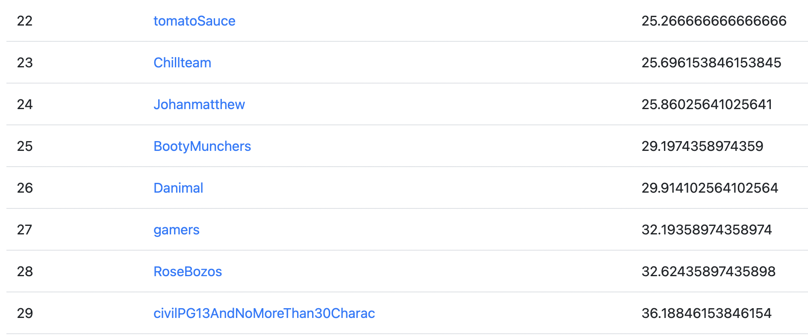

# Fall 2022 CS170 Project Skeleton
This repository contains utility functions which might be helpful for solving the project.

## Requirements
`python >= 3.6` is needed for `starter.py`, which contains a handful of utility functions, to run properly; it was, nevertheless, developed in python 3.9.  
Jupyter Notebook is required should you prefer using `main.ipynb`.
You may need to install some python libraries. All you have to do is run the first cell block of `main.ipynb`.

## Licence
Copyright 2022, The Regents of the University of California and UC Berkeley CS170 Staff  
All rights reserved.  
This content is protected and may not be shared, uploaded, or distributed without prior permission. 

## Reflection
The algorithm that we developed is a greedy graph traversal algorithm. We begin by assigning each node to a team (different methodologies for assigning initial teams that we tried include DFS'ing through the graph or iterating through the list of nodes and assigning each node to the smallest adjacent team, DFS'ing or iterating through the nodes and assigning each node to the smallest overall team, and randomly assigning teams). Then, we visit every node again (either by DFS or iterating through the list of nodes), and then reassign that node by choosing between the smallest adjacent team and the smallest total team; we make this decision by changing the node's team to both options, scoring the resulting graphs, and then choosing the team that results in the better score. We repeat this process for each possible number of teams, from k=1 to k=|V|, while keeping track of the best case.

We think this is a good approach because it allows us to minimize the second and third terms in the cost function while conceding the first term. Since the second and third terms grow exponentially and the first term grows polynomially, it is more valuable to reduce the second and third terms.

Other approaches that we tried include dynamic programming and simulated annealing. In theory, they both would have been performed better than our current algorithm, but in reality, we were unsuccessful in creating functional implementations of these ideas.

The only computational resources that we used were the hive machines.

## Instructions for running the algorithm
In 'all_solvers.ipynb' jupyter notebook, there are 12 functions, each named solve(), listed under the headings "Solution #1-6" and "Other". To run our algorithm, simply define each solve() function one at a time, and then execute run_all() on the test set using the currently defined solve() function. It is important to note that most of the solve() functions are very similar (naturally, because they are progressions of one another), but all of them have been preserved for the purpose of recreating results, so it is necessary to run them all. It should also be noted that there is a dynamic programming algorithm called solve_DP(), but it does not work, so you should not try to use it.

## Results
Our team ended up getting 25th place out of 242 teams. Click on [this](CS_170_Leaderboard.pdf) to see full leaderboard.

